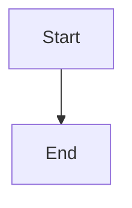

# qus0in dev blog

Astro 기반 개인 기술 블로그입니다. 콘텐츠는 Markdown/MDX로 관리하고, 공개 글은 Cloudflare Workers Assets 대상으로 빌드 및 배포합니다.

## Current shape

- 공개 콘텐츠는 `src/content/published`만 로드합니다.
- 초안은 `src/content/draft`, 보관용 파일은 `src/content/archive`로 관리합니다.
- 공개 글 URL은 파일명 기반 8자리 해시로 생성됩니다.
- 빌드 전에 사이트 키워드와 OG 이미지를 자동 생성합니다.
- Markdown/MDX에서 Mermaid 다이어그램을 바로 사용할 수 있습니다.
- 글 상세 페이지에는 링크 복사, 공유, 함께 보기, 세션 기반 조회수 집계 로직이 포함됩니다.
- 조회수 저장소는 Cloudflare D1을 사용하고, 로컬 개발과 배포 환경은 분리해서 다룹니다.

## Stack

- Astro
- React
- Tailwind CSS
- `@tailwindcss/typography`
- `astro-mermaid`
- Cloudflare adapter for Astro
- Cloudflare D1

## Requirements

- Node.js `>=22.12.0`
- `pnpm`

## Commands

| Command | Description |
| :-- | :-- |
| `pnpm dev` | 개발 서버 실행 |
| `pnpm preview` | 빌드 결과 로컬 확인 |
| `pnpm build` | 사이트 키워드와 OG 이미지를 생성한 뒤 프로덕션 빌드 |
| `pnpm blog:publish` | `src/content/draft` 글을 KST 기준 발행 시각으로 `published/YYYY/MM` 아래로 이동 |
| `pnpm migration:local` | 로컬 D1에 마이그레이션 적용 |
| `pnpm migration:remote` | 원격 D1에 마이그레이션 적용 |
| `pnpm migration:all` | 로컬과 원격 D1에 모두 마이그레이션 적용 |
| `pnpm generate-types` | Wrangler 타입 생성 |
| `pnpm blog:deploy` | 빌드 후 Cloudflare에 배포 |

## Environment

- `PUBLIC_GOOGLE_ANALYTICS_ID`
  - GA4 측정 ID를 넣으면 공통 레이아웃에 분석 스크립트를 삽입합니다.
  - 값이 없으면 GA 스크립트는 삽입되지 않습니다.
- `PUBLIC_ENABLE_KAKAO_AD`
  - `true`면 메인과 글 상세 페이지의 카카오 광고 영역을 렌더링합니다.
  - `false`면 광고 컴포넌트가 렌더링되지 않습니다.

## Content

공개 글은 `src/content/published/**/*.md(x)`에서만 읽습니다.

예시:

```text
src/content/published/2026/04/26-04-07_do.md
```

초안은 `src/content/draft` 아래에 두고, `pnpm blog:publish`로 공개 상태로 이동합니다.

frontmatter 예시는 다음과 같습니다.

```md
---
title: .do URL이 사라진 이유
description: 초기 Java 웹에서 흔했던 .do URL이 현대 Spring과 REST 설계에서 사라진 이유
pubDate: 2026-04-07T09:00:00+09:00
tags:
  - java
  - spring
  - servlet
  - rest
  - web-architecture
---
```

콘텐츠 규칙:

- `draft: true/false`는 더 이상 사용하지 않습니다.
- 태그는 영어만 사용합니다.
- 태그는 최대 10개까지 허용합니다.
- 기존 공개 글과 의미 있게 겹치는 태그를 일부 재사용합니다.

이 규칙은 [src/content.config.ts](./src/content.config.ts) 와 [scripts/publish-drafts.mjs](./scripts/publish-drafts.mjs) 에 구현되어 있습니다.

## URL rule

공개 URL은 파일명 자체를 노출하지 않습니다. 파일명에서 확장자를 제외한 basename에 32비트 FNV-1a 해시를 적용해 8자리 hex 경로를 만듭니다.

예시:

- 파일명: `26-04-07_do`
- 공개 경로: `/<8자리 해시>/`

이 규칙은 [src/lib/blog.ts](./src/lib/blog.ts) 와 [scripts/generate-og.mjs](./scripts/generate-og.mjs) 에서 같이 사용합니다. 따라서 파일명을 바꾸면 공개 URL과 OG 경로도 함께 바뀝니다.

## Build outputs

빌드 전 생성 단계:

- [scripts/generate-site-keywords.mjs](./scripts/generate-site-keywords.mjs)
  - `src/content/published`의 태그 빈도를 집계해 상위 10개 키워드를 생성합니다.
- [scripts/generate-og.mjs](./scripts/generate-og.mjs)
  - 사이트 기본 OG와 글별 OG 이미지를 `public/og`에 생성합니다.

예를 들어 어떤 글의 공개 URL이 `/abcd1234/`라면 OG 이미지는 `/og/abcd1234.png`가 됩니다.

## Views and D1

- 조회수는 [src/pages/api/views.ts](./src/pages/api/views.ts) 에서 처리합니다.
- 같은 세션에서 같은 글을 다시 열면 브라우저 `sessionStorage`와 서버 쿠키 기준으로 중복 증가를 줄입니다.
- 로컬 개발에서는 기본적으로 로컬 D1을 사용하고, 운영 조회수와 분리됩니다.
- D1 설정은 [wrangler.jsonc](./wrangler.jsonc) 와 [migrations/0001_post_views.sql](./migrations/0001_post_views.sql) 에 있습니다.

권장 순서:

```bash
pnpm migration:local
pnpm migration:remote
pnpm dev
```

## Mermaid

Markdown/MDX에서 아래처럼 Mermaid 블록을 사용할 수 있습니다.

````md

````

Mermaid는 [astro.config.mjs](./astro.config.mjs) 에서 전역 설정을 사용합니다. 큰 다이어그램은 한국어 가독성을 위해 쪼개서 쓰는 쪽을 기본 원칙으로 둡니다.

## Deployment

- Astro Cloudflare adapter를 사용합니다.
- 배포 명령은 `pnpm blog:deploy` 입니다.
- 배포 전에 `pnpm build`가 실행됩니다.
- 운영 조회수 집계를 쓰려면 D1 binding과 migration 적용 상태를 먼저 맞춰야 합니다.

## Local skills

이 저장소에는 유지보수용 로컬 스킬이 포함되어 있습니다.

- `blog-tag-strategy`: `src/content` 태그를 영어 기준으로 설계하고 기존 태그 어휘와 연결
- `git-convention-commit`: Conventional Commit 형식과 한국어 subject 규칙 유지
- `package-version-bump`: 코드 변경 시 `package.json` 버전을 최소 patch로 올리는 기준 적용
- `korean-natural-rewrite`: 번역체나 AI 어투를 줄이고 기술 글 문장을 자연스럽게 정리
- `mermaid-editorial-design`: Mermaid의 색상, 구도, spacing, 모바일 가독성 기준 유지
- `readme-sync`: README를 실제 현재 동작과 일치하게 유지

## Maintenance notes

- README는 실제 코드 경로와 스크립트 이름을 기준으로 갱신합니다.
- short URL 규칙을 바꾸면 링크, RSS, 구조화 데이터, OG 생성 경로를 함께 확인해야 합니다.
- 파일명 기반 URL을 쓰므로 콘텐츠 파일 rename은 공개 경로 변경으로 이어집니다.
- 코드 변경 커밋에는 버전 증가 규칙으로 최소 patch bump를 적용합니다.

## License

이 프로젝트는 MIT 라이선스를 따릅니다.
