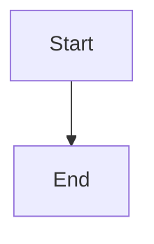

# qus0in dev blog

Astro 기반 개인 기술 블로그 프로젝트입니다. 콘텐츠는 `src/content` 아래 Markdown/MDX로 관리하고, 프런트엔드는 React와 Tailwind CSS로 구성합니다. 배포 대상은 Cloudflare Workers Assets입니다.

## Current shape

- 단일 블로그 컬렉션을 `src/content`에서 로드합니다.
- 공개 글 URL은 파일 내용이 아니라 **파일명 기반 8자리 해시**로 생성됩니다.
- 빌드 시 OG 이미지를 자동 생성합니다.
- Markdown/MDX에서 Mermaid 다이어그램을 바로 사용할 수 있습니다.
- 본문 타이포그래피와 목차 스타일은 블로그 글 읽기 경험에 맞게 별도 조정되어 있습니다.

## Stack

- Astro
- React
- Tailwind CSS
- `@tailwindcss/typography`
- Cloudflare adapter for Astro
- Mermaid via `astro-mermaid`

## Requirements

- Node.js `>=22.12.0`
- `pnpm`

## Commands

| Command | Description |
| :-- | :-- |
| `pnpm dev` | 개발 서버 실행 |
| `pnpm build` | OG 이미지 생성 후 프로덕션 빌드 |
| `pnpm preview` | 빌드 결과 로컬 확인 |
| `pnpm deploy` | Cloudflare 배포 |
| `pnpm generate:og` | OG 이미지 수동 생성 |

## Environment

- Google Analytics를 쓰려면 `PUBLIC_GOOGLE_ANALYTICS_ID` 환경변수에 GA4 측정 ID를 넣습니다.
- 예시: `PUBLIC_GOOGLE_ANALYTICS_ID=G-XXXXXXXXXX`
- 이 값이 없으면 분석 스크립트는 삽입되지 않습니다.

## Content

콘텐츠 파일은 현재 `src/content/backend` 아래에 두고 있습니다.

예시:

```text
src/content/backend/26-04-07_do.md
```

frontmatter 최소 예시는 다음과 같습니다.

```md
---
title: .do URL이 사라진 이유
description: 초기 Java 웹에서 흔했던 .do URL이 현대 Spring과 REST 설계에서 사라진 이유
pubDate: 2026-04-07
tags:
  - java
  - spring
draft: false
---
```

## URL rule

공개 URL은 파일명 자체를 노출하지 않습니다. 대신 파일명에서 확장자를 제외한 값에 32비트 FNV-1a 해시를 적용해 8자리 hex short URL을 만듭니다.

예시:

- 파일명: `26-04-07_do`
- 공개 경로: `/<8자리 해시>/`

이 규칙은 [blog.ts](./src/lib/blog.ts)와 [generate-og.mjs](./scripts/generate-og.mjs)에서 같이 사용합니다. 따라서 파일명을 바꾸면 공개 URL과 OG 경로도 함께 바뀝니다.

## Mermaid

Markdown/MDX에서 아래처럼 Mermaid 블록을 사용할 수 있습니다.

````md

````

Mermaid는 [astro.config.mjs](./astro.config.mjs)에서 전역 설정을 사용합니다.

- 폰트: `Noto Sans KR, Pretendard, sans-serif`
- 기본 테마: `base`
- 저채도 색상 팔레트
- 넉넉한 node/rank spacing

한국어 라벨이 겹치지 않도록 큰 다이어그램은 쪼개서 사용하는 쪽을 기본 원칙으로 둡니다.

## OG image

빌드 시 [generate-og.mjs](./scripts/generate-og.mjs)가 `public/og` 아래 이미지를 다시 생성합니다.

- 사이트 기본 OG: `public/og/site.png`
- 글별 OG: 파일명 기반 short URL과 동일한 이름의 PNG

예를 들어 어떤 글의 공개 URL이 `/abcd1234/`라면 OG 이미지는 `/og/abcd1234.png`가 됩니다.

## Deployment

- Astro + Cloudflare adapter 조합을 사용합니다.
- 배포 명령은 `pnpm deploy`이며 내부적으로 `pnpm build && wrangler deploy`를 실행합니다.
- 배포 환경에 `PUBLIC_GOOGLE_ANALYTICS_ID`를 설정하면 모든 페이지의 공통 레이아웃에서 GA4 스크립트를 로드합니다.

## Local skills

이 저장소에는 문서와 커밋 일관성을 위한 로컬 스킬이 포함되어 있습니다.

- `git-convention-commit`: Conventional Commit 형식과 한국어 subject 규칙 유지
- `korean-natural-rewrite`: 번역체/AI 어투 완화, 명사형 제목 정리, 메타데이터 보강
- `mermaid-editorial-design`: Mermaid의 색상, 구도, spacing, 모바일 가독성 기준 유지
- `readme-sync`: README를 실제 현재 동작과 일치하게 유지

## Maintenance notes

- README를 갱신할 때는 실제 코드 경로와 스크립트를 기준으로 수정합니다.
- short URL 규칙을 바꾸면 링크, RSS, 구조화 데이터, OG 생성 경로를 함께 확인해야 합니다.
- 콘텐츠 작성 시 제목은 명사형 중심으로 정리하고, Mermaid는 설명력이 높아지는 구간에만 선택적으로 사용합니다.

## License

이 프로젝트는 MIT 라이선스를 따릅니다.
