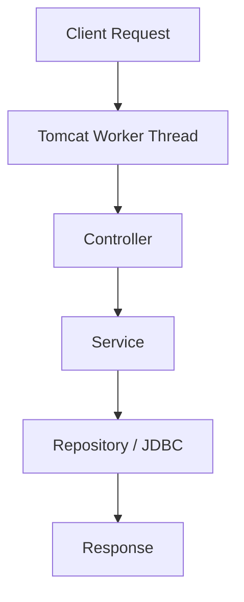

# 서버로 올라오면 동시성은 갑자기 인프라 냄새가 난다

JVM 안에서 동시성을 이야기할 때는 보통 `Thread`, `synchronized`, `AtomicInteger` 같은 도구부터 떠올린다. 그런데 서버 애플리케이션으로 올라오는 순간 질문이 달라진다.

- 요청 하나에 스레드를 몇 개나 쓸 것인가
- DB 응답을 기다리는 동안 스레드를 계속 붙잡아 둘 것인가
- Tomcat 풀을 키우는 게 맞는가, 아니면 실행 모델을 바꿔야 하는가

즉, 서버에서의 동시성은 "변수 하나를 안전하게 증가시키는 법"보다 **제한된 실행 자원으로 많은 요청을 어떻게 흘릴 것인가**에 더 가깝다.

이번 글은 그 관점에서 Spring MVC와 WebFlux를 다시 본다. 프레임워크 취향 비교가 아니라, 서버 실행 모델의 차이로 보는 편이 더 정확하다.

## 서버 실행 모델

### WAS가 하는 일

Tomcat 같은 WAS를 단순히 Spring을 올리는 그릇처럼 보면 중요한 부분을 놓치기 쉽다. 실제로 WAS는 요청을 받아 스레드에 배정하고, 요청-응답 생명주기를 돌리는 실행 환경이다.

대략 흐름은 이렇다.

1. HTTP 요청 수신
2. worker thread 할당
3. Filter, Servlet, `DispatcherServlet`, Controller 실행
4. 비즈니스 로직과 DB 접근 수행
5. 응답 반환 후 스레드 반납

이 구조가 중요한 이유는, 요청량이 늘수록 "코드가 몇 줄인가"보다 "스레드를 얼마나 오래 붙잡는가"가 먼저 병목이 되기 때문이다.

## Spring MVC

### 요청당 스레드 모델

Spring MVC는 전형적으로 요청 하나에 스레드 하나를 배정하는 모델로 이해하면 된다.



이 모델의 장점은 분명하다.

- 흐름이 직관적이다
- 스택 트레이스가 읽기 쉽다
- JDBC, JPA 같은 전통적 생태계와 잘 맞는다
- 팀이 익숙한 방식으로 유지보수하기 쉽다

그래서 많은 서비스는 지금도 이 모델로 충분히 잘 돈다.

### 어디서 막히는가

문제는 I/O 대기다. DB 응답을 기다리거나 외부 API가 늦을 때, 요청을 맡은 스레드는 그 시간 동안 거의 놀고 있어도 반환되지 않는다.

즉, 요청이 몰릴 때 실제 병목은 CPU가 아니라 "대기 중인 스레드 수"가 된다.

그래서 전통적인 튜닝은 보통 이런 식으로 이어진다.

- Tomcat thread pool 크기 조정
- DB connection pool 크기 조정
- 쿼리 시간 줄이기
- 외부 API 타임아웃 조정

여기서 중요한 점은, MVC가 느린 것이 아니라 **블로킹 I/O 대기를 스레드 비용으로 지불하는 모델**이라는 점이다.

## WebFlux

### 이벤트 루프 모델

Spring WebFlux는 이 문제를 다른 층에서 푼다. 요청마다 스레드를 오래 붙잡지 않고, 이벤트 루프와 논블로킹 I/O로 적은 수의 스레드가 많은 연결을 돌리게 한다.

```java
@GetMapping("/orders/{id}")
public Mono<Order> getOrder(@PathVariable Long id) {
    return orderService.findById(id)
        .timeout(Duration.ofSeconds(3));
}
```

여기서 핵심은 `Mono`나 `Flux` 문법보다 "대기 중인 요청을 스레드에 묶어 두지 않는다"는 실행 모델이다.

### WebFlux가 강한 곳

WebFlux는 다음 같은 상황에서 힘을 낸다.

- 외부 API 호출이 많다
- 스트리밍 응답이 있다
- WebSocket, SSE처럼 오래 열린 연결이 많다
- 요청 수는 많지만 각 요청의 CPU 작업은 크지 않다

반대로 일반적인 CRUD 서비스에서 JDBC와 JPA를 그대로 쓰면서 WebFlux만 얹으면, 기대한 이점을 제대로 못 얻는 경우가 많다. 실행 모델은 논블로킹인데, 밑단은 여전히 블로킹일 수 있기 때문이다.

## DB 경계

### 서버 동시성과 DB 동시성은 다르다

서버 애플리케이션에서 자주 생기는 오해가 있다. 애플리케이션 레벨 락과 DB 정합성을 같은 문제로 보는 것이다.

예를 들어 같은 재고를 동시에 차감하는 상황을 생각해 보면, Tomcat worker thread가 몇 개인지보다 더 중요한 것은 결국 **같은 row를 누가 어떤 순서로 갱신하는가**다.

즉, 서버 동시성은 요청 실행 모델의 문제이고, DB 동시성은 트랜잭션과 락, 격리 수준의 문제다.

`synchronized`는 JVM 인스턴스 하나 안에서만 의미가 있다. 서버를 두 대 띄우는 순간 이 보장은 사라진다. 그래서 실제 정합성은 대개 다음 층에서 맞춘다.

- DB 트랜잭션
- `SELECT ... FOR UPDATE`
- 낙관적 락 버전 컬럼
- 유니크 인덱스와 제약 조건

## Virtual Thread

### MVC 쪽의 반격

Java 21의 Virtual Thread가 주목받는 이유는, MVC 진영이 오랫동안 안고 있던 비용을 JVM이 줄여 주기 때문이다.

```java
try (var executor = Executors.newVirtualThreadPerTaskExecutor()) {
    executor.submit(() -> orderService.findById(id));
}
```

이 접근은 "논블로킹 코드로 다 갈아타자"보다 "동기 코드 스타일은 유지하되 스레드 비용을 덜 내자"에 가깝다.

그래서 최근에는 새 프로젝트에서 다음 조합이 훨씬 자주 검토된다.

- Spring MVC + Virtual Thread
- 기존 JDBC/JPA 유지
- 코드 가독성과 디버깅 난이도 유지

이 조합이 모든 상황의 정답은 아니다. 배압, 장시간 스트리밍, 리액티브 파이프라인 같은 요구가 강하면 WebFlux가 더 자연스럽다. 다만 "높은 동시성 = WebFlux"라는 단순 공식은 이제 예전보다 설득력이 약하다.

## Kotlin의 자리

Kotlin을 쓰면 선택지가 조금 달라진다. WebFlux 위에 `Mono`, `Flux`를 직접 쓰기보다 `suspend fun`과 `Flow`로 읽기 쉽게 유지할 수 있기 때문이다.

```kotlin
@GetMapping("/orders/{id}")
suspend fun getOrder(@PathVariable id: Long): Order {
    val order = orderService.findById(id)
    val user = userService.findById(order.userId)
    return order.copy(userName = user.name)
}
```

이 방식은 "논블로킹 실행 모델"과 "동기처럼 읽히는 코드"를 동시에 가져가려는 쪽이다. Kotlin 팀이 있는 조직에서는 이 선택이 꽤 자연스럽다.

## 선택 기준

결국 질문은 프레임워크 선호가 아니라 부하 성격이다.

### MVC가 잘 맞는 경우

- 전통적인 CRUD와 DB 트랜잭션이 중심이다
- JDBC, JPA 생태계를 그대로 쓴다
- 팀이 스택 트레이스와 디버깅 단순성을 중시한다
- Java 21 이상을 쓸 수 있다

### WebFlux가 잘 맞는 경우

- 외부 네트워크 호출이 많다
- 장시간 연결이나 스트리밍이 있다
- 배압이 설계 핵심이다
- 이미 리액티브 스택에 익숙하다

### Kotlin Coroutines가 잘 맞는 경우

- Kotlin 기반 서비스다
- 비동기 코드를 동기처럼 읽고 싶다
- WebFlux나 논블로킹 드라이버를 함께 쓸 준비가 되어 있다

## 정리

Spring MVC와 WebFlux의 차이는 API 스타일보다 실행 모델의 차이로 보는 편이 정확하다.

- MVC는 요청당 스레드 모델이다
- WebFlux는 이벤트 루프 기반 논블로킹 모델이다
- Virtual Thread는 MVC의 오래된 비용을 JVM 차원에서 줄인다
- DB 정합성 문제는 여전히 별도 층에서 다뤄야 한다

그래서 서버에서의 동시성 판단은 "비동기 문법이 더 멋진가"로 끝나지 않는다. 요청이 어디서 오래 머무는지, 스레드 비용을 어디서 내는지, 정합성은 어느 층에서 맞출지를 같이 봐야 한다.

다음 글에서는 이 문제가 서버 한 대 안에서 끝나지 않고, Redis 분산 락, Kafka, Saga처럼 네트워크를 건너는 문제로 어떻게 바뀌는지 본다.
