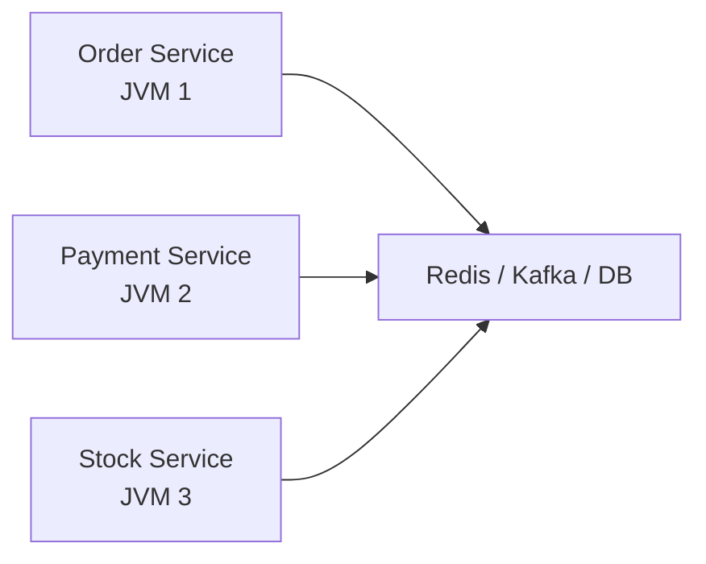

# `synchronized`가 갑자기 아무 소용 없어지는 순간이 있다

애플리케이션 서버 한 대만 떠 있을 때는 동시성 문제가 비교적 익숙하다. 같은 JVM 안에서 스레드가 겹치고, 필요하면 락을 걸고, 정합성은 DB 트랜잭션으로 맞춘다.

그런데 서버를 두 대, 세 대로 늘리는 순간 이야기가 달라진다.

- 인스턴스 A의 락은 인스턴스 B에 보이지 않는다
- 같은 주문을 서로 다른 서버가 동시에 처리할 수 있다
- 트랜잭션은 서비스 경계를 넘는 순간 한 번에 묶기 어려워진다

즉, 분산 환경에서의 동시성은 "같은 메모리를 누가 건드리나"가 아니라 **같은 사실을 여러 프로세스가 어떻게 맞춰 가는가**의 문제다.

이번 글은 그 지점에서 왜 Redis, Kafka, Saga 같은 도구가 등장하는지 정리한다.

## 경계 변화

### 모놀리식 안에서의 동시성

모놀리식에서는 많은 문제가 한 JVM 안에서 끝난다.

- JVM 내부 락
- `ConcurrentHashMap`
- DB 트랜잭션
- 단일 인스턴스 캐시

이 구조에서는 "공유 메모리 + 단일 DB"라는 전제가 꽤 강하게 작동한다. 그래서 정합성 문제도 상대적으로 한곳에서 다루기 쉽다.

### 분산 환경으로 넘어가는 순간

마이크로서비스나 수평 확장이 시작되면 전제가 깨진다.



이제는 같은 요청 흐름이 여러 JVM, 여러 DB, 여러 네트워크 홉을 건넌다. 이 상태에서 JVM 내부 락은 거의 설명력을 잃는다.

## 분산 환경에서 새로 생기는 문제

### 분산 락

여러 서버 인스턴스가 같은 리소스를 동시에 처리하려 하면, JVM 안의 `synchronized`는 더 이상 소용이 없다. 외부 조율자가 필요하다.

그래서 많이 나오는 선택지가 Redis 기반 분산 락이다.

```java
RLock lock = redisson.getLock("order:" + orderId);

if (lock.tryLock(3, 10, TimeUnit.SECONDS)) {
    try {
        processOrder(orderId);
    } finally {
        lock.unlock();
    }
}
```

이 방식은 빠르고 실용적이다. 다만 "무조건 정답"처럼 쓰기 시작하면 곤란하다. 락 만료, 네트워크 지연, 클럭 차이 같은 문제가 끼어들 수 있기 때문이다.

즉, 분산 락은 강력한 도구지만 모든 정합성 문제를 덮는 만능 열쇠는 아니다.

### 분산 트랜잭션

모놀리식에서는 `@Transactional` 하나로 묶이던 작업이, 서비스가 갈라지는 순간 여러 DB로 흩어진다.

예를 들어 주문 생성, 결제 승인, 재고 차감이 각기 다른 서비스에 있다면 "모두 성공하거나 모두 실패"를 한 번에 강제하기가 어렵다.

2PC 같은 고전적 분산 트랜잭션은 가능은 하지만, 성능과 가용성 비용이 너무 크다. 그래서 현대 시스템은 대개 다른 길을 택한다.

### 결국의 일관성

분산 시스템에서는 강한 일관성을 끝까지 밀기보다, 결국의 일관성을 받아들이는 경우가 많다.

> **결국의 일관성(eventual consistency)** 은 잠깐의 불일치를 허용하되, 시간이 지나면 상태가 맞춰진다고 보는 모델이다.

이 말은 "대충 맞으면 된다"가 아니다. 불일치가 생길 수 있다는 사실을 인정하고, 그 틈을 보상 로직과 재처리 흐름으로 관리한다는 뜻이다.

## Kafka가 하는 일

### 동시 접근 대신 순서화

메시지 큐가 중요한 이유는, 여러 서비스가 같은 자원을 직접 잡아당기며 수정하는 대신 **순서를 가진 이벤트 흐름**으로 바꿔 주기 때문이다.

```kotlin
kafkaTemplate.send("order-events", order.id, OrderCreatedEvent(order))
```

키가 같은 이벤트를 같은 파티션으로 보내면, 같은 주문에 대한 이벤트는 한 줄로 세워 처리할 수 있다.

이 방식의 장점은 분명하다.

- 같은 자원에 대한 처리를 순서화하기 쉽다
- 서비스 간 결합을 줄일 수 있다
- 재처리와 리플레이 전략을 세우기 쉽다

결국 메시지 큐는 "공유 메모리를 잘 잠그자"가 아니라 "서로 같은 상태를 동시에 직접 만지지 말자"는 방향에 가깝다.

## Saga가 하는 일

### 한 번에 롤백하지 않고 되돌린다

분산 트랜잭션을 대체하는 가장 실무적인 패턴 중 하나가 Saga다. 핵심은 간단하다.

- 단계별 작업은 각 서비스가 자기 트랜잭션으로 처리한다
- 중간에 실패하면 이전 단계의 보상 작업으로 되돌린다

예를 들어 이런 흐름이다.

1. 주문 생성
2. 결제 승인
3. 재고 차감
4. 배송 준비

여기서 재고 차감이 실패하면, 결제 취소 같은 보상 작업이 뒤따른다.

```kotlin
if (stockResult.isFailure) {
    paymentService.refund(order)
    return
}
```

이 패턴이 중요한 이유는, 분산 환경에서 "모두 한 번에 롤백"이 어려울 때 **실패를 전제로 복구 흐름을 설계**하게 만들기 때문이다.

### choreography와 orchestration

Saga는 크게 두 방식으로 나뉜다.

- choreography: 이벤트로 다음 단계를 서로 이어 감
- orchestration: 중앙 조율자가 흐름을 관리함

이벤트 기반 방식은 결합이 낮지만 전체 흐름을 읽기 어려워질 수 있다. 중앙 조율 방식은 흐름은 명확하지만 조율자가 시스템의 중요한 축이 된다.

실무에서는 기술보다 추적 가능성이 더 큰 쟁점이 되기도 한다. 어느 단계에서 실패했고, 어떤 보상이 실행됐는지 보이지 않으면 운영 난이도가 급격히 올라간다.

## Redis와 Kafka는 역할이 다르다

둘 다 분산 시스템에서 자주 등장하지만 해결하는 문제가 다르다.

### Redis

- 짧은 시간의 상호 배제
- 캐시
- 세션
- rate limiting
- 빠른 상태 조회

### Kafka

- 이벤트 전달
- 순서 보장
- 비동기 통신
- 재처리
- 읽기 모델 분리

즉, Redis는 "지금 이 순간 누가 먼저 하느냐"를 조율하는 쪽에 가깝고, Kafka는 "이 사건들이 어떤 순서로 흘렀느냐"를 관리하는 쪽에 가깝다.

## 관측 가능성

분산 동시성에서 빠지기 쉬운 부분이 하나 더 있다. 시스템을 나누는 것만큼 추적 수단도 같이 나눠야 한다는 점이다.

분산 환경에서는 다음 질문에 답할 수 있어야 한다.

- 같은 요청이 어떤 서비스들을 거쳤는가
- 어느 단계에서 실패했는가
- 보상 작업은 실행됐는가
- 이벤트가 중복 소비됐는가
- 락 대기나 재시도는 얼마나 발생했는가

이 지점부터는 동시성 문제가 곧 관측 가능성 문제와 붙는다. Redis 락을 도입했는데 대기가 얼마나 늘었는지 모르면, 시스템은 더 안전해진 것이 아니라 더 불투명해진 것에 가깝다.

## 선택 기준

분산 환경에서의 선택은 도구 이름보다 문제 형태로 보는 편이 낫다.

### Redis 분산 락이 잘 맞는 경우

- 짧은 임계 구역을 보호하면 된다
- 강한 순서 제어가 잠깐 필요하다
- 전체 흐름을 큐 기반으로 바꿀 정도는 아니다

### Kafka가 잘 맞는 경우

- 처리 순서가 중요하다
- 서비스 간 비동기 분리가 필요하다
- 재처리와 이벤트 로그가 중요하다

### Saga가 필요한 경우

- 여러 서비스의 상태 변경이 한 요청에 묶인다
- 한 번에 커밋할 수 없다
- 실패 복구를 명시적으로 설계해야 한다

## 정리

서버를 여러 대 띄우는 순간 동시성 문제는 완전히 다른 얼굴을 갖는다.

- JVM 락은 서비스 경계를 넘지 못한다
- 트랜잭션은 DB 하나를 넘는 순간 복잡해진다
- 정합성은 점점 "잠그는 문제"보다 "흐름을 설계하는 문제"가 된다

그래서 분산 환경의 동시성은 결국 세 방향으로 정리된다.

- 짧은 상호 배제가 필요하면 락
- 순서화가 필요하면 메시지 큐
- 여러 단계의 실패 복구가 필요하면 Saga

결론은 언제나 하나로 수렴한다. 스케일이 커질수록 "공유 상태를 잘 잠그는 법"보다 "공유 자체를 줄이고, 메시지와 이벤트로 흘리는 법"이 더 중요해진다.
