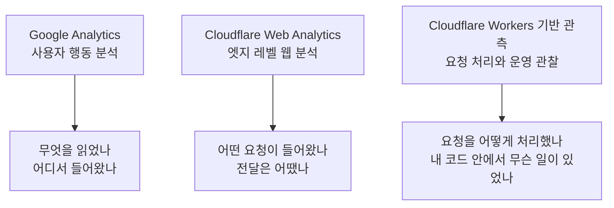

# Google Analytics, Cloudflare Web Analytics, Workers 관측은 서로 무엇이 다를까

기술 블로그를 운영하다 보니 예전 플랫폼 블로그에서 기본으로 주어지던 **통계**를 이제는 직접 골라 붙여야 했다. 처음에는 **Google Analytics**와 **Cloudflare Web Analytics**를 비교하면 끝나는 문제라고 생각했다.

그런데 실제로 써 보니 내가 서로 다른 층위를 한데 묶어서 보고 있었다. 특히 상파울루, 네덜란드 등지에서 `/.env`와 그 파생 경로를 반복 조회하는 요청을 보고 처음에는 "**Cloudflare Web Analytics**가 이런 것도 잘 보여주는구나"라고 생각했다. 다시 보니 이건 단순 웹 분석보다는 **Worker** 레벨의 요청 관측에 더 가까운 이야기였다.

이 경험을 기준으로 다시 정리하면 구분은 세 가지다.

- **Google Analytics**는 사용자 행동 분석 도구다.
- **Cloudflare Web Analytics**는 엣지 레벨 웹 분석 도구다.
- **Cloudflare Workers** 기반 관측은 애플리케이션 운영 관측에 가깝다.

즉, 비슷해 보여도 같은 질문에 답하는 도구가 아니다.

> **Web Analytics** 와 **Observability** 는 비슷해 보여도 같은 범주가 아니다.

## 세 가지 관점

같은 트래픽을 보더라도 질문이 다르다.

- "**누가 어떤 글을 읽었나?**"
- "**어떤 요청이 들어왔나?**"
- "**내 Worker가 그 요청을 어떻게 처리했나?**"

## 1. Google Analytics: 사용자 행동 분석

**Google Analytics**는 브라우저 안에서 실행되는 스크립트로 데이터를 모은다.

> **클라이언트 사이드(client-side)** 는 사용자의 브라우저에서 코드가 실행되는 방식을 뜻한다.

그래서 이 도구는 사람의 행동을 읽는 데 강하다.

- 어떤 글이 많이 읽혔는지
- 검색, SNS, 외부 링크 중 어디서 유입됐는지
- 클릭, 스크롤, 전환 같은 이벤트가 얼마나 발생했는지
- 어느 페이지에서 이탈이 많았는지

> **이벤트(event)** 는 페이지뷰, 클릭, 스크롤, 다운로드처럼 사용자의 특정 행동을 하나의 기록 단위로 저장한 것이다.

콘텐츠 성과나 유입 분석에는 여전히 가장 직접적이다. 반면 광고 차단기나 추적 방지 기능 영향을 많이 받고, 비정상 요청이나 서버 단 이상 징후는 거의 보여주지 못한다.

## 2. Cloudflare Web Analytics: 엣지 레벨 웹 분석

**Cloudflare Web Analytics**는 사용자 요청이 **Cloudflare** 엣지를 통과하는 흐름을 기준으로 본다.

> **엣지(edge)** 는 원본 서버보다 사용자 가까이에서 요청을 먼저 받는 CDN 또는 프록시 지점을 말한다.

이 도구는 사용자 세부 행동보다 요청과 전달 상태를 더 잘 본다.

- 요청이 얼마나 들어왔는지
- 어떤 경로가 많이 호출됐는지
- 페이지뷰가 어느 정도 발생했는지
- 전달 성능이 대체로 어떤지

정적 블로그에서는 이쪽 숫자가 더 안정적으로 보일 때가 많다. **Google Analytics**처럼 브라우저 스크립트가 막혀서 통계가 빠지는 문제가 덜하기 때문이다.

> **TTFB(Time To First Byte)** 는 요청 후 첫 번째 바이트를 받기까지 걸린 시간을 뜻한다.

다만 여기서 선을 그어야 한다. **Cloudflare Web Analytics**는 어디까지나 **웹 분석**이다. 엣지에서 본 요청과 전달 흐름은 보여주지만, 내 애플리케이션 코드 내부에서 어떤 분기와 처리가 일어났는지까지 설명해 주지는 않는다.

## 3. Cloudflare Workers 기반 관측: 운영과 처리 흐름

내가 `.env` 경로 탐색 시도를 보고 혼동했던 부분이 바로 여기다. 그 신호는 "**페이지가 얼마나 읽혔는가**"가 아니라 "**들어온 요청을 내 코드가 어떻게 처리했는가**"에 가까웠다.

> **Observability** 는 서비스 내부에서 무슨 일이 일어나는지 로그, 메트릭, 트레이스 같은 신호로 파악할 수 있는 능력을 뜻한다.

**Cloudflare Workers**로 배포하면 요청을 직접 처리하게 되므로, 단순 요청 수를 넘어서 운영 문맥을 붙여 볼 수 있다.

- 어떤 경로 요청을 차단했는지
- 어떤 국가나 도시에서 비정상 요청이 반복되는지
- 특정 요청을 캐시로 보냈는지, 원본으로 보냈는지
- 어떤 분기에서 어떤 응답 코드를 반환했는지
- 처리 시간이 어디서 길어졌는지

즉, **Workers 기반 관측**은 **Cloudflare Web Analytics**의 상위 버전이라기보다, 아예 다른 층위의 도구라고 보는 편이 맞다.

## 한눈에 비교

| 관점         | Google Analytics          | Cloudflare Web Analytics               | Cloudflare Workers 기반 관측     |
| ------------ | ------------------------- | -------------------------------------- | -------------------------------- |
| 주된 질문    | 누가 무엇을 읽었나        | 어떤 요청이 들어왔나                   | 요청을 어떻게 처리했나           |
| 관찰 위치    | 브라우저                  | Cloudflare 엣지                        | Worker 실행 코드                 |
| 강한 영역    | 유입, 이벤트, 콘텐츠 성과 | 요청량, 페이지뷰, 경로 분포, 전달 흐름 | 로그, 분기 처리, 차단, 응답 제어 |
| 약한 영역    | 비정상 요청, 서버 처리    | 사용자 세부 행동, 코드 내부 처리       | 마케팅 분석, 유입 경로 분석      |
| 잘 맞는 용도 | 콘텐츠 운영               | 웹 트래픽 파악                         | 운영 관측과 디버깅               |

## 언제 무엇을 보면 되나

### Google Analytics를 볼 때

- 어떤 글이 실제로 잘 읽히는지 보고 싶을 때
- 검색 유입과 SNS 유입을 구분하고 싶을 때
- 클릭, 스크롤, 전환 같은 사용자 행동을 보고 싶을 때

### Cloudflare Web Analytics를 볼 때

- 사이트 전체 요청 흐름을 빠르게 훑고 싶을 때
- 경로별 요청량이나 404 분포를 보고 싶을 때
- 정적 블로그 기준으로 페이지뷰를 비교적 안정적으로 보고 싶을 때

### Workers 기반 관측을 볼 때

- 수상한 요청이 어디서 반복되는지 알고 싶을 때
- 특정 요청을 왜 차단했는지 추적하고 싶을 때
- 코드 분기, 응답 상태, 처리 시간을 운영 관점에서 보고 싶을 때

## 정리

핵심은 세 도구를 한 줄로 묶지 않는 것이다.

- **Google Analytics**는 사람의 행동을 본다.
- **Cloudflare Web Analytics**는 웹 요청과 전달 흐름을 본다.
- **Cloudflare Workers** 기반 관측은 애플리케이션의 처리 과정을 본다.

블로그 운영에서 무엇이 더 중요하냐는 결국 질문에 달려 있다. "**누가 읽었나**"를 알고 싶으면 **Google Analytics**, "**어떤 요청이 들어왔나**"를 알고 싶으면 **Cloudflare Web Analytics**, "**내 Worker가 그 요청을 어떻게 처리했나**"를 알고 싶으면 **Workers 기반 관측**을 보면 된다.
