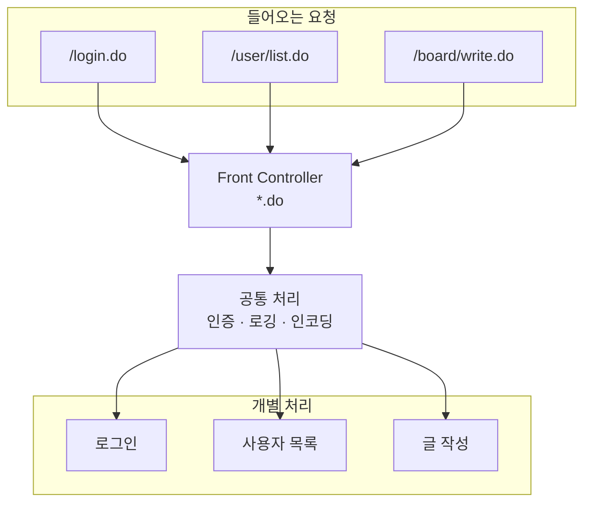
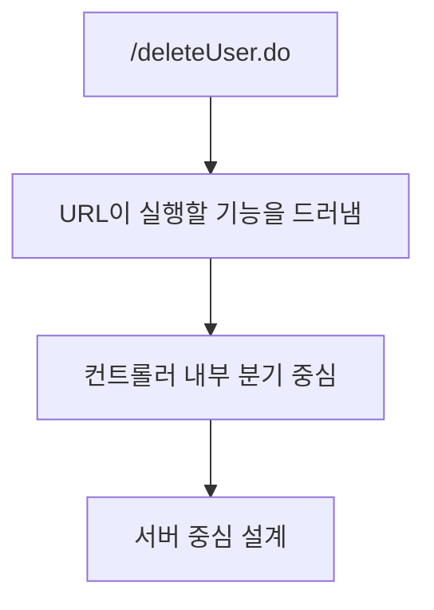
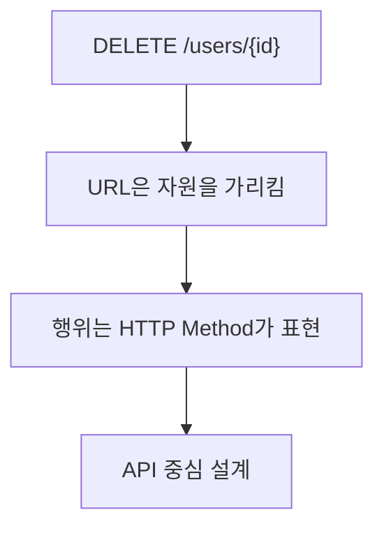

# 그 많던 `.do`는 어디로 갔을까?

내가 2010년대 말에 자바 웹을 처음 배울 때는 다음과 같은 URL이 아주 흔했다.

```
/login.do
/user/list.do
/board/write.do
```

특히 JSP + Servlet + 초기 Spring Framework 기반 강의나 교재에서는 `.do` 패턴이 거의 기본처럼 등장했다.

조금 더 거슬러 올라가면 이것은 단지 Spring 초창기 취향이라기보다, **Servlet 시대 일부의 전통**에 가까웠다. `*.do`, `*.jsp`, `*.action`처럼 확장자나 접미사로 요청 성격을 나누는 방식이 꽤 널리 쓰였기 때문이다.

지금도 해당 패턴이 아예 멸종한 것은 아니지만 전성기(?) 때 비하면 신규 웹에서는 자주 보이지 않는다.

대신 아래와 같은 구조가 더 익숙할 것이다.

```
GET    /users
POST   /users
DELETE /users/{id}
```

이 변화 뒤에는 단순한 문법 차이가 아니라 **웹 아키텍처의 변화**가 있다.

## `.do` URL의 배경

초기 Servlet/JSP 및 Spring MVC 환경에서는 `.do`가 꽤 합리적인 선택이었다. 당시 기술 환경을 보면 이유를 쉽게 이해할 수 있다.

| 관점             | 설명                                                                      |
| ---------------- | ------------------------------------------------------------------------- |
| 서블릿 매핑 구조 | `web.xml`에서 `*.do`로 매핑하여 모든 요청을 하나의 서블릿으로 집중        |
| Front Controller | 하나의 컨트롤러에서 분기 처리하기 위한 단순한 라우팅 전략                 |
| URL 설계 방식    | REST 개념이 없어서 “동작(action)” 중심 URL 사용 (`login.do`, `delete.do`) |
| 정적/동적 분리   | `.html`, `.css`는 그대로 서빙하고 `.do`만 서버 로직 처리                  |
| 컨테이너 특성    | 초기 Apache Tomcat 등 WAS 구조에서 확장자 기반 분리가 효율적              |
| Struts 컨벤션    | `ActionServlet`과 `*.do` 조합이 사실상 기본 설정처럼 받아들여짐           |
| Spring 초기 설계 | `DispatcherServlet`도 `*.do` 패턴을 자연스럽게 지원                       |

`.do`는 단순한 관습이 아니라

> **“모든 요청을 한 곳으로 모으기 위한 기술적 해결책”**

였다.

여기에는 **Struts**의 영향도 컸다. 한때는 `ActionServlet`이 `*.do` 요청을 받아 `Action`으로 넘기는 흐름이 너무 널리 퍼져 있어서, `.do` 자체가 자바 웹의 기본 문법처럼 느껴질 정도였다.

> **Struts**는 Spring MVC 이전 시기에 널리 쓰이던 자바 웹 MVC 프레임워크다.

### 기능 중심 URL

초기 자바 웹 애플리케이션은 지금처럼 리소스 중심으로 API를 설계하기보다, 서버가 어떤 기능을 수행할지를 URL에 직접 담는 경우가 많았다.

예를 들어 아래 두 URL은 "무엇을 가리키는가"보다 "어떤 동작을 실행하는가"에 초점이 맞춰져 있다.

```
/memberLogin.do
/deleteBoard.do
```

이 구조는 HTML 폼 제출과 서버 렌더링이 중심이던 애플리케이션에서는 자연스러웠다. 요청 하나가 곧 화면 이동이나 비즈니스 로직 실행으로 이어졌기 때문이다.

### Front Controller 패턴

`.do` 패턴은 모든 동적 요청을 한곳에 모아 한번에 처리하기 쉬웠다.

> **Front Controller**는 들어오는 HTTP 요청을 먼저 하나의 진입점에서 받은 뒤, 요청에 맞는 실제 처리 로직으로 넘기는 구조를 뜻한다.

예를 들어 사용자가 `/login.do`, `/user/list.do`, `/board/write.do`를 호출하더라도 서버는 먼저 하나의 공통 컨트롤러에서 요청을 받은 뒤 내부에서 분기할 수 있다. URL마다 서블릿을 하나씩 두기보다, 먼저 한 곳에서 받은 다음 나누는 방식이다.

- 인증, 인가 처리
- 공통 예외 처리
- 요청 로깅
- 인코딩 설정

이런 공통 관심사를 `*.do` 매핑 아래에서 한꺼번에 적용하기 쉬웠다. 프레임워크가 지금보다 덜 추상화되어 있던 시기에는 이런 단순한 규칙이 오히려 유지보수에 도움이 되기도 했다.

다만 이 지점은 지금 기준으로 보면 많이 달라졌다. 예전에는 이런 공통 처리를 **Front Controller**가 직접 떠안는 경우가 많았지만, 지금은 상당수가 **Filter**나 **AOP**로 빠져나갔다.

> **Filter**는 서블릿 진입 전후에 공통 처리를 끼워 넣는 웹 계층 구성요소다.

> **AOP**는 로깅, 트랜잭션, 보안처럼 반복되는 횡단 관심사를 공통 규칙으로 분리하는 방식이다.

즉, 과거에는 "`*.do`로 한 입구에 몰아넣고 거기서 공통 처리까지 같이 한다"는 설계가 의미 있었지만, 지금은 인증, 로깅, 인코딩, 트랜잭션 같은 관심사가 별도 계층으로 분리되면서 그 설명 방식 자체가 사실상 사장되었다.

### 요청 집중 구조

초기 Servlet 기반 애플리케이션의 요청 흐름을 단순화하면 아래와 같다.



`*.do`로 들어오는 요청이 먼저 한 입구로 모이고, 그 뒤에 공통 처리와 개별 분기가 이어진다.

같은 흐름을 `web.xml`과 Servlet 코드로 구현하던 시절에는 `.do` 패턴이 꽤 자연스러운 선택이었다.

```xml
<servlet-mapping>
    <servlet-name>frontController</servlet-name>
    <url-pattern>*.do</url-pattern>
</servlet-mapping>
```

여기서 중요한 것은 `.do` 자체가 아니라, `*.do`로 들어오는 요청을 하나의 입구에서 통제할 수 있다는 점이다. 이후 Spring MVC의 `DispatcherServlet`은 이런 패턴을 프레임워크 차원에서 더 체계적으로 제공했다.

## `.do` URL의 쇠퇴 배경

지금은 `.do`를 굳이 사용할 이유가 거의 없다. 기술 스택과 설계 방식이 달라졌기 때문이다.

| 변화 요소            | 영향                                                              |
| -------------------- | ----------------------------------------------------------------- |
| RESTful 설계 도입    | URL이 “행위”가 아니라 “자원”을 표현하도록 변화                    |
| HTTP Method 활용     | GET/POST/PUT/DELETE로 동작을 구분 → `.do` 불필요                  |
| 애노테이션 기반 매핑 | `@GetMapping`, `@PostMapping`으로 자유로운 URL 설계 가능          |
| Spring 버전 변화     | Spring 3.x 이후 애노테이션 기반 MVC, Spring 5/6에서는 완전한 표준 |
| web.xml 제거         | Java Config / Spring Boot에서 URL 패턴 제약 사라짐                |
| SEO 및 API 설계      | 확장자 없는 URL이 더 의미 있고 표준적                             |

특히 Spring의 변화가 결정적이다.

- Spring 2.x → XML 기반 (`*.do` 사용)
- Spring 3.x → Annotation MVC 등장
- Spring Boot 이후 → **확장자 없는 URL이 기본 전제**

### 경로와 메서드 중심 라우팅

현대 프레임워크에서는 요청을 어떤 확장자로 구분할지보다, 어떤 경로와 HTTP 메서드에 매핑되는지가 더 중요하다.

예를 들어 오늘날의 Spring Boot에서는 다음과 같은 방식이 훨씬 자연스럽다.

```java
@GetMapping("/users/{id}")
@DeleteMapping("/users/{id}")
@PostMapping("/users")
```

이 구조에서는 `.do` 같은 확장자가 굳이 필요하지 않다. 메서드와 경로만으로도 요청의 의도를 충분히 구분할 수 있기 때문이다.

### 브라우저 경로와 API 경로의 분리

과거에는 JSP 페이지 이동과 서버 액션 호출이 뒤섞여 있었지만, 지금은 다음처럼 책임이 더 분명하다.

- 브라우저 페이지 라우팅
- REST API 엔드포인트
- 정적 리소스 서빙

이제는 각각이 프레임워크와 서버 설정 안에서 더 분명하게 분리되므로, 동적 요청만 따로 `.do`로 표시할 이유가 없어졌다.

여기에 더해 공통 처리의 담당자도 달라졌다. 예전처럼 하나의 프런트 컨트롤러가 많은 책임을 안기보다, 웹 계층에서는 **Filter**, 애플리케이션 계층에서는 **AOP**, 라우팅 자체는 프레임워크 매핑이 맡는 구조가 일반적이다.

## URL 설계 패러다임 전환

`.do`가 사라졌다는 것은 단순히 문법이 바뀌었다는 뜻이 아니다. 그 뒤에는 다음과 같은 패러다임의 전환이 있다.

### 기능 중심 URL



### 자원 중심 URL



결국 달라진 지점은 이렇다.

> **“URL이 ‘무엇을 할지’가 아니라 ‘무엇인지’를 표현하도록 바뀌었다”**

`.do`는 특정 시대에는 합리적인 해법이었지만, REST와 현대 Spring 구조에서는 더 이상 필요하지 않은 설계 방식이 되었다.

## `.do` URL의 역사적 위치

`.do`가 중요하지 않게 된 이유는 그것이 "구식이라 틀린 방식"이어서가 아니다. 당시 기술 조건에서는 꽤 실용적인 선택이었기 때문이다.

- XML 기반 설정이 일반적이었고
- 서버 렌더링이 중심이었으며
- URL을 세밀하게 설계하는 문화가 약했고
- 프레임워크가 지금처럼 많은 규칙을 제공하지 않았다

`.do`는 낡은 흔적이라기보다, 자바 웹이 지나온 설계의 역사에 더 가깝다.

## 정리

`.do` URL이 사라진 이유는 취향이 바뀌어서가 아니라 웹 애플리케이션의 설계 기준이 달라졌기 때문이다. 과거에는 요청을 한곳에 모으고 동작 중심으로 처리하는 것이 중요했다면, 지금은 자원 중심 URL과 HTTP 메서드, 프레임워크의 라우팅 기능이 그 역할을 맡고 있다.

결론적으로 `.do`의 퇴장은 문법 유행의 종료가 아니라, 자바 웹이 기능 중심 설계에서 자원 중심 설계로 넘어오는 과정을 보여준다.
