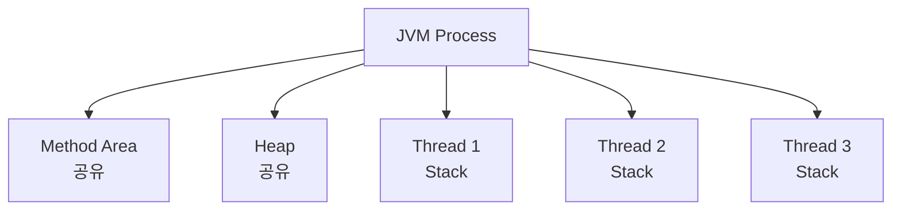
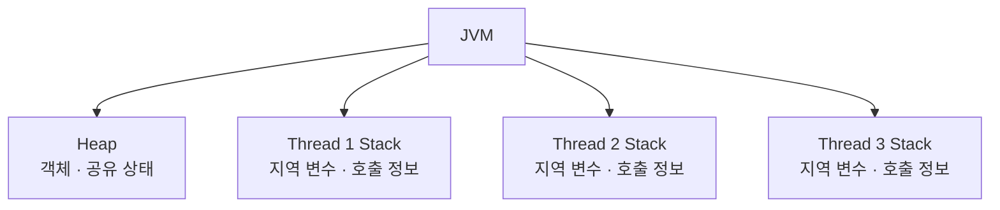
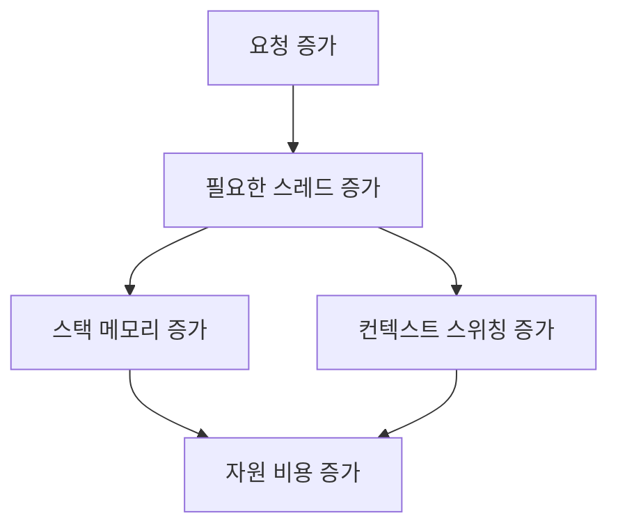
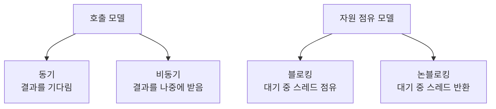
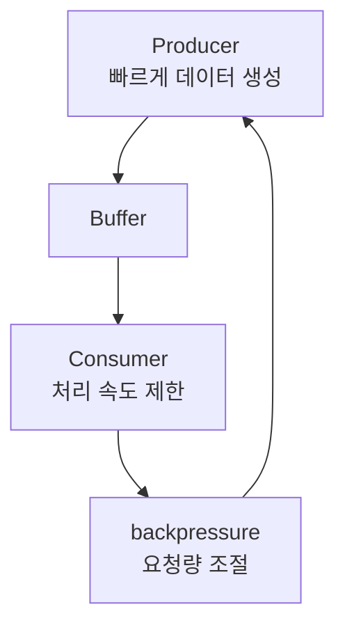
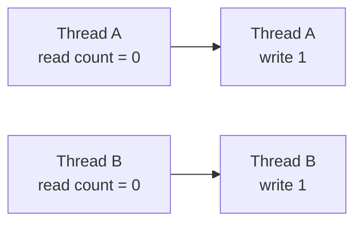

# 동시성이요? 어... 그러니까 얘가 스레드고, 얘는... 어... 다시 말씀해주시겠어요?

`Java에서 동시성 처리에 대해서 이야기해주세요.`라는 말을 들었을 때 사람은 둘로 나뉜다. 뭔 말인지 모르겠는 사람과 도대체 어디서부터 이야기해야할지 모르겠는 사람.

일반적인 백엔드 엔지니어 채용 과정에서 `순정 Java(JVM) 개발자`를 채용하는 경우는 거의 없기에 (SRE면 모르겠다...) 실은 JVM, 서버/RDBMS, 분산 처리 등에 대한 이해도를 고루 묻는 질문일 수 있다. (혹은 그냥 AI를 통해 만들어낸 질문지일 수도 있지만 얼추 이 흐름을 이해하고 '어느 쪽으로 대답해야할까요?'라고 묻기만 해도 손해볼 일은 없다.)

일단 여기에서는 JVM 계열(Java/Kotlin) 등에서의 동시성이란 무엇인지 대략적으로 훑어보고자 한다.

Spring MVC로 단순한 CRUD 흐름을 따라갈 때만 해도 동시성(concurrency)은 그렇게 앞에 나오지 않는 경우가 많다. 요청이 들어오고, Controller를 거쳐 Service와 Repository를 지나 응답이 나간다는 그림만 보면 일단은 동기 코드로도 충분히 설명이 되기 때문이다.

분위기가 달라지는 시점은 보통 성능 이야기가 붙을 때다. 요청 수가 늘고, DB 대기가 길어지고, 비동기 처리나 리액티브 모델, Virtual Thread 같은 선택지를 검토하기 시작하면 결국 다시 보게 되는 것은 JVM의 스레드 모델이다.

처음 자바 서버 코드를 볼 때는 동시성 문제가 꽤 단순하게 느껴진다. 스레드가 여러 개 돌고, 공유 변수만 조심하면 되고, 필요하면 `synchronized`를 쓰면 된다고 이해하기 쉽다.

조금 더 공부해 보면 질문은 금방 늘어난다.

- 왜 `ExecutorService`가 필요할까
- 왜 `CompletableFuture`가 나왔을까
- 왜 리액티브까지 갔을까
- 왜 Java 21에서는 다시 Virtual Thread를 이야기할까

이 변화는 API 취향의 문제가 아니라, JVM이 오래 안고 있던 제약을 다른 방식으로 우회해 온 흐름에 더 가깝다.

- 스레드는 비싸다
- 공유 상태는 위험하다

자원(resource) 이야기를 하다가 결국 스레드와 메모리 구조까지 보게 되는 이유도 이 두 줄에서 출발한다.

## 실행 단위

### 프로세스와 스레드

운영체제 관점에서 프로세스(process)는 독립된 실행 단위다. JVM 애플리케이션을 실행하면 OS 프로세스 하나가 뜨고, 그 안에서 JVM이 힙(heap), 스택(stack), 메서드 영역 같은 런타임 메모리를 관리한다.

> 여기서 `Method Area`는 HotSpot 구현의 세부 메모리 구획 이름이라기보다, 클래스 메타데이터와 런타임 상수 풀 같은 "클래스 수준 정보가 놓이는 논리적 영역" 정도로 이해하면 충분하다. 구현체와 JVM 버전에 따라 실제 내부 구성은 조금씩 다를 수 있다.

스레드(thread)는 그 프로세스 안의 실행 흐름이다. 같은 프로세스 안에 있는 스레드들은 힙을 공유하고, 각자 스택을 따로 가진다.

이 구조를 보면 동시성 문제는 대체로 힙에서 시작된다고 이해할 수 있다.

> 더 정확히 말하면 동시성 문제가 "힙에서만" 생기는 것은 아니다. 다만 여러 스레드가 함께 접근하는 변경 가능한 객체 상태가 주로 힙에 있기 때문에, 실무에서 부딪히는 경쟁 조건과 가시성 문제 상당수가 힙에 놓인 공유 상태에서 출발한다고 보는 편이 가깝다.



스레드마다 실행 흐름은 따로 있지만, 객체 상태는 같이 본다. 그래서 "여러 요청이 동시에 들어온다"는 말은 곧 "여러 실행 흐름이 같은 상태를 동시에 건드릴 수 있다"는 뜻으로 이어진다.

### JVM 메모리와 자원

동시성을 이야기할 때 자원(resource)을 아껴야 한다는 표현이 자주 나온다. 여기서 자원은 CPU 시간만 뜻하지 않는다. JVM 안에서는 대략 이런 것들이 함께 묶여 문제를 만든다고 이해하면 편하다.

- 스레드마다 필요한 스택 메모리
- 객체가 쌓이는 힙
- GC가 관리해야 하는 메모리 양
- 락(lock)을 잡고 있는 동안 묶이는 실행 흐름
- 대기 중인데도 반환되지 않는 스레드

처음 보는 입장에서는 힙과 스택의 차이만 분명히 잡아도 도움이 된다.

- 힙(heap): 객체 인스턴스가 올라가는 공유 메모리
- 스택(stack): 메서드 호출 정보와 지역 변수가 쌓이는 스레드별 메모리

힙은 여러 스레드가 같이 보고, 스택은 각 스레드가 따로 가진다. 이 차이 때문에 지역 변수만 다루는 코드는 상대적으로 안전해 보이고, 여러 스레드가 같은 객체 필드를 수정하기 시작하면 공유 상태(shared mutable state) 문제가 바로 나타난다.



자원 관점에서도 이 구조는 중요하다. 스레드를 많이 만들면 스택도 그만큼 늘고, 힙에 객체가 많이 쌓이면 GC 부담도 커진다. 그래서 서버 성능 이야기를 하다 보면 "코드가 맞느냐" 다음으로 "이 실행 모델이 메모리와 스레드를 얼마나 쓰느냐"를 함께 보게 된다.

### 스레드 비용

여기서 첫 번째 제약이 나온다. 플랫폼 스레드(platform thread)는 공짜가 아니다.

- 운영체제 스케줄링 대상이다
- 스택 메모리를 차지한다
- 컨텍스트 스위칭 비용이 있다
- 많아질수록 디버깅도 어려워진다

초기 JVM이 Green Thread를 쓰다가 결국 Native Thread로 넘어간 이유도 이 비용과 연결해서 이해할 수 있다. 멀티코어를 제대로 활용하려면 OS 스레드를 피하기 어려웠지만, 그 대가로 스레드 하나의 비용을 계속 안고 가게 된 셈이다.



그래서 "스레드를 더 만들면 되지 않나?"라는 생각은 어느 순간 한계에 부딪힌다. 이후 비동기 모델, 리액티브, 코루틴, Virtual Thread 같은 선택지가 계속 등장한 배경도 여기에서 찾을 수 있다.

## 호출 모델

### 동기와 비동기

동기(synchronous)와 비동기(asynchronous)는 먼저 호출 관계를 설명하는 말이다.

- 동기: 결과가 나올 때까지 호출 흐름이 거기 머문다
- 비동기: 결과를 나중에 받기로 하고 다음 흐름을 먼저 진행한다

이 구분은 블로킹(blocking), 논블로킹(non-blocking)과는 다르다. 동기는 "기다리는 방식"이고, 블로킹은 "기다리는 동안 실행 자원을 붙잡는 방식"에 더 가깝다.

초반에 이 둘을 분리해서 보는 편이 설계 판단에는 도움이 된다.



이 둘을 섞어서 부르면 설명이 흐려진다. 요청 하나의 의미 흐름은 동기적으로 작성하되, 실제 실행은 논블로킹으로 만들 수도 있기 때문이다. Kotlin 코루틴이 자주 그런 식으로 읽힌다.

### JVM 비동기 도구의 흐름

JVM 비동기 프로그래밍의 변화는 늘 이전 방식의 불편을 줄이는 쪽으로 이어졌다고 볼 수 있다.

### 콜백

가장 먼저 떠오르는 방식은 콜백(callback)이다.

```java
fetchUser(id, user -> {
    fetchOrders(user, orders -> {
        fetchPayment(orders.get(0), payment -> {
            process(payment);
        });
    });
});
```

이 방식은 I/O를 기다리며 다른 일을 할 수 있다는 장점이 있지만, 흐름이 깊어질수록 읽기 어려워진다. 에러 처리와 취소 처리도 금방 엉키기 쉽다.

### Future와 CompletableFuture

Java 8의 `CompletableFuture`는 이 중첩을 체인으로 바꿨다.

```java
CompletableFuture.supplyAsync(() -> fetchUser(id))
    .thenApply(user -> fetchOrders(user))
    .thenAccept(orders -> process(orders))
    .exceptionally(ex -> {
        log.error("processing failed", ex);
        return null;
    });
```

콜백보다는 낫지만, 여전히 "비동기 흐름을 비동기답게" 읽어야 한다. 데이터가 계속 밀려올 때 소비자가 감당할 만큼만 받도록 흐름을 조절해야 하는 상황까지는 잘 설명하지 못하는 편이다.

### Reactive Streams

그다음 단계가 Reactor 같은 리액티브 모델이다.

```java
userRepository.findById(id)
    .flatMapMany(orderRepository::findByUser)
    .filter(order -> order.getAmount() > 1000)
    .collectList()
    .subscribe(this::process);
```

여기서 중요한 것은 단순 비동기가 아니라 배압(backpressure)이다.

> **배압(backpressure)** 은 소비자가 감당할 수 있는 만큼만 데이터를 받도록 흐름을 조절하는 규칙이다.



이 모델은 네트워크 스트리밍이나 대량 이벤트 처리처럼 "계속 흘러오는 데이터"를 다루는 데 강하다. 다만 위 예시는 `collectList()`로 최종적으로 한 번 모으는 흐름이라, 배압을 끝까지 드러내는 예시라기보다는 리액티브 체인 문법을 보여주는 쪽에 가깝다. 실제로 배압 특성을 더 살피려면 스트림을 계속 흘리거나 소비 속도 제어가 드러나는 예시를 함께 보는 편이 낫다.

### Kotlin Coroutines

Kotlin은 같은 문제를 언어 레벨에서 다르게 풀었다.

```kotlin
suspend fun processOrder(id: String) {
    val user = userRepo.findById(id)
    val orders = orderRepo.findByUser(user)
    process(orders)
}
```

겉으로 보면 동기 코드처럼 읽히지만, 실제로는 일시 중단과 재개로 동작한다. 다만 이것이 자동으로 논블로킹(non-blocking)을 뜻하는 것은 아니다. 호출 대상이 suspend-friendly 하거나 논블로킹 I/O를 지원할 때 그 장점이 제대로 살아난다고 보는 편이 맞다. JDBC처럼 블로킹 API 위에 얹으면 코루틴 문법을 써도 스레드 점유 자체는 그대로 남을 수 있다.

### Virtual Thread

Java 21의 Virtual Thread는 질문을 다시 뒤집는다.

> 비동기 코드를 더 잘 쓰게 만들기보다, 동기 코드를 써도 스레드 비용을 덜 치르게 하면 되지 않을까?

```java
try (var executor = Executors.newVirtualThreadPerTaskExecutor()) {
    executor.submit(() -> {
        var user = userRepo.findById(id);
        var orders = orderRepo.findByUser(user);
        process(orders);
        return null;
    });
}
```

이 방식은 기존 코드 스타일을 크게 바꾸지 않으면서도, 대기 중인 스레드 비용을 JVM 쪽에서 줄이려는 시도로 읽힌다. 그래서 최근 JVM 비동기 논의는 "리액티브냐 아니냐"보다 "어느 층에서 비용을 감출 것인가"에 더 가깝게 보인다.

## 공유 상태

### 동시성과 병렬성

동시성(concurrency)과 병렬성(parallelism)도 자주 섞이지만 다른 말이다.

- 동시성: 여러 작업이 겹쳐 진행되는 상태
- 병렬성: 여러 작업이 실제로 동시에 실행되는 상태

웹 애플리케이션에서는 대체로 동시성이 먼저 문제다. 여러 요청이 같은 시각대에 겹쳐 들어오고, 그 요청들이 같은 상태를 건드릴 때 무엇이 깨질지가 더 중요하기 때문이다.

### 경쟁 조건

가장 흔한 문제는 경쟁 조건(race condition)이다.

```java
private int count = 0;

public void increment() {
    count++;
}
```

`count++`는 한 번의 연산처럼 보이지만 실제로는 읽기, 계산, 쓰기 세 단계다. 두 스레드가 그 사이에 끼어들면 결과가 달라질 수 있다.



### 가시성

값을 한 스레드가 바꿨다고 해서 다른 스레드가 바로 그 값을 보는 것도 아니다.

```java
private volatile boolean running = true;
```

`volatile`은 원자적 갱신을 보장하는 도구가 아니라, 메모리 가시성(visibility)을 맞추는 도구다. 이 차이를 놓치면 "보이기는 하지만 안전하지 않은 코드"가 나오기 쉽다.

### 교착 상태

락이 둘 이상이면 교착 상태(deadlock)도 나온다. 순서가 서로 다르면, 각자 상대 락이 풀리기만 기다리며 멈춘다.

이쯤 오면 "락을 잘 건다"보다 "락 순서를 통일한다" 또는 "락이 덜 필요한 구조를 만든다"는 쪽이 더 중요하게 보인다.

## 도구의 방향

### synchronized에서 Atomic까지

JVM 동시성 도구의 흐름은 점점 같은 방향으로 움직였다고 정리할 수 있다.

- `synchronized`: 가장 직접적인 임계 구역 보호
- `Lock`: 더 세밀한 타임아웃과 제어
- `Atomic`: CAS 기반의 lock-free 갱신
- `ConcurrentHashMap`, `LongAdder`: 경합을 분산하는 자료구조

이 변화는 단순한 성능 튜닝이라기보다, 락 하나에 모든 경쟁을 몰아넣지 않으려는 방향으로 이해하는 편이 자연스럽다.

### 불변과 메시지 패싱

더 뒤로 가면 결국 두 가지 전략으로 수렴한다.

- 변경 가능한 공유 상태를 줄인다
- 공유 대신 메시지 전달로 바꾼다

Kotlin의 `Channel`, `Mutex`, actor 패턴이 자주 이야기되는 이유도 여기와 닿아 있다.

```kotlin
val mutex = Mutex()

suspend fun safeIncrement() {
    mutex.withLock {
        count++
    }
}
```

물론 이것도 "공유 상태를 안전하게 다룬다"는 문제를 완전히 피해 가는 것은 아니다. 다만 상태를 한곳에 가두고 접근 경로를 좁히는 데는 도움이 된다.

## Java와 Kotlin의 갈림길

실무에서는 기술 선택이 철학보다는 비용으로 갈리는 경우가 많다.

### Java

최근 Java는 Virtual Thread 쪽으로 무게가 많이 실렸다. 기존 동기 코드를 크게 뜯지 않고 처리량을 올릴 수 있기 때문이다.

그렇다고 리액티브가 끝났다고 보기는 어렵다. 스트리밍, 배압, 이벤트 파이프라인 같은 영역에서는 여전히 리액티브가 자연스럽다. 다만 일반적인 요청-응답 서비스에서는 "리액티브를 꼭 써야 하나"라는 질문이 예전보다 훨씬 강해졌다고 볼 수 있다.

### Kotlin

Kotlin은 코루틴이 워낙 자연스럽게 녹아 있어서, 비동기 코드 가독성 측면에서 장점이 분명하다. `suspend`, `Flow`, structured concurrency를 받아들이면 코드가 깔끔해진다.

대신 이쪽도 공짜는 아니다. dispatcher, cancellation, scope 전파를 이해하지 않으면 오히려 더 헷갈릴 수 있다.

## 선택 기준

JVM 내부만 놓고 보면 기준은 생각보다 단순하다.

- 기존 Java 코드와 생태계를 최대한 유지하고 싶다: Virtual Thread
- 언어 차원에서 비동기 흐름을 더 자연스럽게 쓰고 싶다: Kotlin Coroutines
- 스트리밍과 배압이 핵심이다: Reactive Streams

이 셋은 서로를 완전히 대체한다기보다, 어떤 비용을 어느 층에서 감출지에 따라 갈린다고 보는 편이 맞아 보인다.

## 정리

JVM 동시성의 흐름은 도구 목록을 외우는 이야기보다 한 가지 제약을 다루는 역사에 가깝다.

- 스레드는 비싸다
- 공유 상태는 위험하다

그래서 JVM은 계속 다음 방향으로 움직여 왔다고 정리할 수 있다.

- 스레드 생성 비용을 줄이거나
- 대기 중인 스레드 점유를 줄이거나
- 공유 상태 접근을 더 잘 통제하거나
- 아예 공유 대신 메시지 전달로 옮기거나

실무에서 먼저 잡아야 할 질문도 비슷하다. 어떤 라이브러리를 쓸지보다, 지금 줄이려는 비용이 스레드 비용인지, 대기 시간인지, 공유 상태 충돌인지부터 구분해 보는 편이 실제 판단에는 더 도움이 된다.
